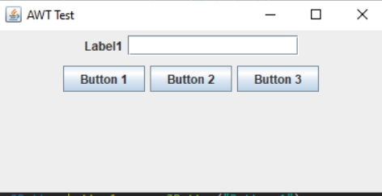

# Lista de Exercícios - CLASSE MODELO_TELA

Projeto da matéria de POO FACENS

## 🚀 Começando

* CRIE UM PROJETO EM JAVA E REPRODUZA O EXEMPLO DO SLIDE ANTERIOR;

* CONFIRA SE O MESMO ESTÁ FUNCIONANDO;

* COMENTE O CÓDIGO ESCRITO DEMONSTRANDO SEUS CONHECIMENTOS SOBRE O ITEM;

* CRIE UM REPOSITÓRIO REMOTO E NOMEIE COM MODELO_TELA;

* CRIE UM README.MD DESCREVENDO O PROJETO E INSIRA UMA IMAGEM DO PROJETO FUNCIONANDO;

* ENVIE O LINK DO REPOSITÓRIO REMOTO NA ATIVIDADE.

## 🛠️ Construído com

* Visual Code

## 📌 Versão

* **Versão 1.0** 

## ✒️ Autores

* **Abrão Alves Trevizan** - *Classe MODELO_TELA* 
